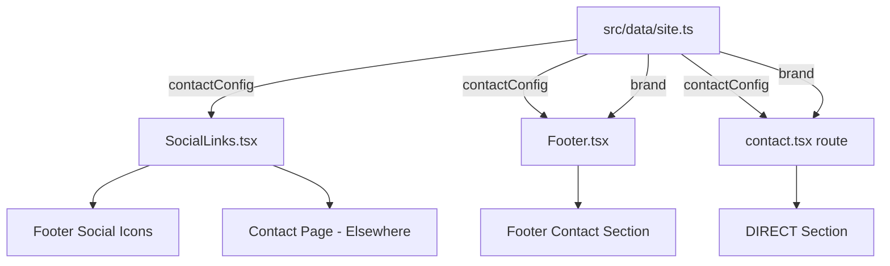

# Design Document

## Overview

This feature updates three contact information values in the central site configuration file (`src/data/site.ts`). The architecture already supports this — `contactConfig` and `brand` are consumed by multiple components that conditionally render links or placeholders based on whether values are populated. The change involves updating string literals only; no structural or logic changes are needed.

**Changes Summary:**
1. Set `contactConfig.instagram` to `https://www.instagram.com/sitesbykamo?utm_source=qr`
2. Set `contactConfig.email` to `kamohelomosiya89@gmail.com`
3. Set `brand.location` from `Midrand, South Africa` to `Alberton, South Africa`

## Architecture

The site follows a **single-source-of-truth** pattern for contact information:



All contact data flows from `src/data/site.ts` outward. Components consume `contactConfig` and `brand` directly via imports and conditionally render active links vs disabled placeholders.

**No architectural changes are required.** The existing conditional rendering logic in `SocialLinks.tsx`, `Footer.tsx`, and the contact route already handles the transition from empty/placeholder to active state.

## Components and Interfaces

### Affected File

**`src/data/site.ts`** — The only file that needs modification.

### Consuming Components (no changes needed)

| Component | Consumes | Behavior |
|-----------|----------|----------|
| `SocialLinks.tsx` | `contactConfig.instagram`, `contactConfig.email` | Renders clickable icon when value is non-empty; disabled placeholder when empty |
| `Footer.tsx` | `contactConfig.email`, `brand.location` | Renders email as `mailto:` link when non-empty; shows location text from `brand.location` |
| `contact.tsx` (route) | `contactConfig.email`, `brand.location` | Renders email in DIRECT section as clickable link when non-empty; shows `brand.location` next to map-pin icon |

### Interface Contract

The `contactConfig` and `brand` objects are exported as `const` assertions. Their shape remains unchanged:

```typescript
export const contactConfig = {
  email: "kamohelomosiya89@gmail.com",      // was: ""
  whatsapp: "27718100711",                   // unchanged
  instagram: "https://www.instagram.com/sitesbykamo?utm_source=qr",  // was: ""
  linkedin: "",                              // unchanged
  github: "https://github.com/Kamo89",      // unchanged
} as const;

export const brand = {
  // ...other fields unchanged
  location: "Alberton, South Africa",        // was: "Midrand, South Africa"
} as const;
```

## Data Models

No new data models are introduced. The existing `contactConfig` and `brand` object shapes remain identical — only their string values change.

| Field | Type | Old Value | New Value |
|-------|------|-----------|-----------|
| `contactConfig.instagram` | `string` | `""` | `"https://www.instagram.com/sitesbykamo?utm_source=qr"` |
| `contactConfig.email` | `string` | `""` | `"kamohelomosiya89@gmail.com"` |
| `brand.location` | `string` | `"Midrand, South Africa"` | `"Alberton, South Africa"` |

## Correctness Properties

*A property is a characteristic or behavior that should hold true across all valid executions of a system-essentially, a formal statement about what the system should do. Properties serve as the bridge between human-readable specifications and machine-verifiable correctness guarantees.*

This feature is a static configuration value update — there are no functions, transformations, or algorithms with meaningful input variation to test. The values are string literals assigned once; there is no input space to explore with randomized testing. The single invariant below is verified by a successful build and visual inspection.

### Property 1: Contact configuration values match specification

*For any* build of the application, the exported `contactConfig.instagram` field SHALL equal `"https://www.instagram.com/sitesbykamo?utm_source=qr"`, the `contactConfig.email` field SHALL equal `"kamohelomosiya89@gmail.com"`, and the `brand.location` field SHALL equal `"Alberton, South Africa"`.

**Validates: Requirements 1.2, 2.2, 3.1**

## Error Handling

No new error handling is needed. The existing conditional rendering pattern already gracefully handles both empty and populated states:

- **Instagram**: `SocialLinks.tsx` checks `href` truthiness — a non-empty string activates the link; empty string renders the disabled placeholder.
- **Email**: Both `Footer.tsx` and `contact.tsx` use ternary checks on `contactConfig.email` to render either a `mailto:` link or placeholder text.
- **Location**: `brand.location` is rendered directly as text — there's no conditional; it always displays whatever string is stored.

## Testing Strategy

**Property-based testing is NOT applicable** for this feature. The change involves updating static string literals in a configuration object — there is no transformation logic, algorithm, or function with meaningful input variation to test.

### Recommended Testing Approach

**Manual visual verification:**
1. Load the site locally and confirm the Instagram icon in the footer is clickable and navigates to `https://www.instagram.com/sitesbykamo?utm_source=qr`
2. Confirm the email link in the footer opens a `mailto:kamohelomosiya89@gmail.com` composer
3. Confirm the DIRECT section on `/contact` shows the email as a clickable link (not placeholder text)
4. Confirm the location reads "Alberton, South Africa" in both the footer and contact page

**Build verification:**
- Run `npm run build` (or the project's build command) to confirm TypeScript compilation succeeds with no type errors after the value changes.

**Why no unit/property tests:**
- The values are static string literals with no logic to exercise
- The conditional rendering logic in consuming components is already proven to work (it correctly shows placeholders now)
- A unit test asserting `contactConfig.email === "kamohelomosiya89@gmail.com"` would be testing a constant, not behavior
- The highest-value verification is a successful build + visual confirmation
