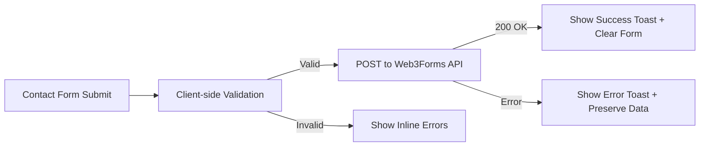

# Design Document: Portfolio Content Improvement

## Overview

This feature covers two targeted improvements to the SitesByKamo portfolio website:

1. **About Section Biography Update** — Replace the existing 2-paragraph biography in the About page with an updated 5-paragraph version that highlights the owner's dual background in development and software testing.

2. **Email-Based Contact Form** — Replace the current WhatsApp redirect form submission with a proper email delivery mechanism using Web3Forms, a free form-to-email API designed for static sites.

Both changes are content and integration focused. The site remains a static React + Vite application deployed on Cloudflare with no server-side backend.

## Architecture

The architecture remains unchanged: a client-side React SPA using TanStack Router, Tailwind CSS, and Vite. The only architectural addition is an outbound HTTP call from the contact form to the Web3Forms API endpoint.



**Key decisions:**

- **Web3Forms over EmailJS/Formspree** — Web3Forms is free (250 submissions/month), requires no npm dependency, works via a single `fetch` POST, requires no signup beyond generating an access key, and supports custom fields and subject lines natively. It has no JavaScript SDK requirement, keeping the bundle unchanged.
- **No backend needed** — The Web3Forms API accepts form data directly from the client. The access key is safe to include client-side (it only determines which inbox receives submissions, similar to a public form action URL).
- **About section text stays in-component** — The biography text is static content with no dynamic variation. Keeping it directly in the `AboutSection` component (or extractable to a data constant) avoids unnecessary indirection.

## Components and Interfaces

### 1. AboutSection Component (`src/components/site/AboutSection.tsx`)

**Change:** Replace the 2-paragraph biography `<div>` content with 5 new paragraphs.

**Interface remains unchanged:**
```typescript
export function AboutSection(): JSX.Element
```

The component continues to render inside the About page at `/about`. The only change is the text content within the existing `div.grid.gap-4` container.

### 2. ContactForm Component (`src/components/site/ContactForm.tsx`)

**Changes:**
- Replace `handleSubmit` to POST form data to Web3Forms API instead of building a WhatsApp link
- Add client-side validation with inline error messages
- Add loading/submitting state during API call
- Remove the disclaimer `<p>` element at the bottom
- Add success/error state handling
- Remove imports of `buildWhatsAppLink` and `defaultWhatsAppMessage`

**Updated interface (internal):**
```typescript
interface FormState {
  submitting: boolean;
  errors: Record<string, string>;  // field name → error message
}

// Validation function
function validateForm(data: FormData): Record<string, string>

// Submit function
async function handleSubmit(event: FormEvent<HTMLFormElement>): Promise<void>
```

**Web3Forms integration:**
```typescript
const WEB3FORMS_ENDPOINT = "https://api.web3forms.com/submit";
const WEB3FORMS_ACCESS_KEY = "<access-key>"; // Generated from web3forms.com for kamohelomosiya89@gmail.com
```

### 3. Site Configuration (`src/data/site.ts`)

**No changes required.** The `contactConfig.email` is already set to `kamohelomosiya89@gmail.com`. The `buildWhatsAppLink` and `defaultWhatsAppMessage` functions remain for use by the WhatsApp chat link on the contact page (which is preserved per Requirement 3).

### 4. Contact Page (`src/routes/contact.tsx`)

**No changes required.** The page layout, direct contact links (email mailto, WhatsApp chat), and "What Happens Next" section all remain as-is. Only the `ContactForm` component's internal behaviour changes.

## Data Models

### Form Submission Payload (sent to Web3Forms)

```typescript
interface ContactFormPayload {
  access_key: string;        // Web3Forms access key
  subject: string;           // "New Project Enquiry — SitesByKamo"
  from_name: string;         // Visitor's name (from form)
  name: string;              // Visitor's name
  email: string;             // Visitor's email
  whatsapp: string;          // WhatsApp number (optional)
  business: string;          // Business/Company name (optional)
  projectType: string;       // Selected project type
  budget: string;            // Budget range (optional)
  timeline: string;          // Timeline (optional)
  description: string;       // Project description
}
```

### Web3Forms API Response

```typescript
interface Web3FormsResponse {
  success: boolean;
  message: string;
}
```

### Validation Rules

| Field | Required | Validation |
|-------|----------|------------|
| Name | Yes | Non-whitespace content (`.trim().length > 0`) |
| Email | Yes | Non-whitespace + valid email format (regex or native) |
| WhatsApp Number | No | None |
| Business/Company | No | None |
| Project Type | Yes | Non-empty selection (not the placeholder) |
| Budget Range | No | None |
| Timeline | No | None |
| Project Description | Yes | Non-whitespace content (`.trim().length > 0`) |

## Correctness Properties

*A property is a characteristic or behavior that should hold true across all valid executions of a system — essentially, a formal statement about what the system should do. Properties serve as the bridge between human-readable specifications and machine-verifiable correctness guarantees.*

### Property 1: Email payload completeness

*For any* valid form submission with all fields populated, the payload sent to the Web3Forms API SHALL include all submitted form field values (Name, Email, WhatsApp Number, Business/Company, Project Type, Budget Range, Timeline, Project Description) without data loss or truncation.

**Validates: Requirements 2.2**

### Property 2: Whitespace-only required fields are rejected

*For any* string composed entirely of whitespace characters (spaces, tabs, newlines) entered into a required field (Name, Email, Project Type, Project Description), the form SHALL reject submission and the validation function SHALL return an error for that field.

**Validates: Requirements 2.7**

### Property 3: Invalid email formats are rejected

*For any* string that does not match a valid email pattern (containing no `@`, missing domain, etc.), the form SHALL reject submission when that string is entered in the Email field.

**Validates: Requirements 2.7**

## Error Handling

| Scenario | Behaviour |
|----------|-----------|
| Validation failure (required field empty/whitespace) | Prevent submission, show inline error beside the failing field, preserve all data |
| Validation failure (invalid email format) | Prevent submission, show inline error beside email field, preserve all data |
| Web3Forms API returns non-200 / network error | Show error toast ("Submission failed — please try again"), preserve all form data |
| Web3Forms API returns `{ success: false }` | Treat as delivery failure, show error toast, preserve form data |
| Web3Forms API returns `{ success: true }` | Show success toast ("Enquiry sent — I'll be in touch"), clear all form fields |
| Web3Forms access key missing/invalid | Same as API error — show error toast to visitor |

**Graceful degradation:** If the Web3Forms API is unreachable (network offline), the form shows the error message and preserves data so the visitor can retry or use the direct email/WhatsApp links displayed alongside the form.

## Testing Strategy

### Unit Tests (Example-Based)

Unit tests cover the static content requirements and specific UI interactions:

- **About section content**: Verify the 5 new paragraphs render in order, old text is absent
- **About section spacing**: Verify paragraphs render as `<p>` elements within a `gap-4` container
- **Form field presence**: Verify all form fields render in the correct order with correct types
- **Success flow**: Mock successful API response → verify toast + fields cleared
- **Error flow**: Mock failed API response → verify error toast + fields preserved
- **WhatsApp removal**: Verify no `window.open` to WhatsApp URL on submit
- **Disclaimer removal**: Verify disclaimer text is absent from rendered form
- **Contact links preserved**: Verify mailto and WhatsApp links remain on the contact page

### Property-Based Tests

Property tests validate universal correctness across randomized inputs:

- **Property 1 — Payload completeness**: Generate random valid form data → build payload → verify all fields are present in the payload object
  - Minimum 100 iterations
  - Tag: `Feature: portfolio-content-improvement, Property 1: Email payload completeness`

- **Property 2 — Whitespace rejection**: Generate random whitespace-only strings → call validation function with them in required fields → verify rejection
  - Minimum 100 iterations
  - Tag: `Feature: portfolio-content-improvement, Property 2: Whitespace-only required fields are rejected`

- **Property 3 — Invalid email rejection**: Generate random strings without valid email structure → call validation function → verify email field error
  - Minimum 100 iterations
  - Tag: `Feature: portfolio-content-improvement, Property 3: Invalid email formats are rejected`

### Testing Library

- **Property-based testing**: Use [fast-check](https://github.com/dubzzz/fast-check) — the standard PBT library for TypeScript/JavaScript. It integrates with Vitest (which is compatible with the project's Vite setup).
- **Component testing**: Vitest + React Testing Library for rendering and asserting DOM output.

### Integration Tests

- Manual verification that Web3Forms delivers emails to kamohelomosiya89@gmail.com after deployment
- Verify the access key works by submitting a test enquiry on the deployed site
