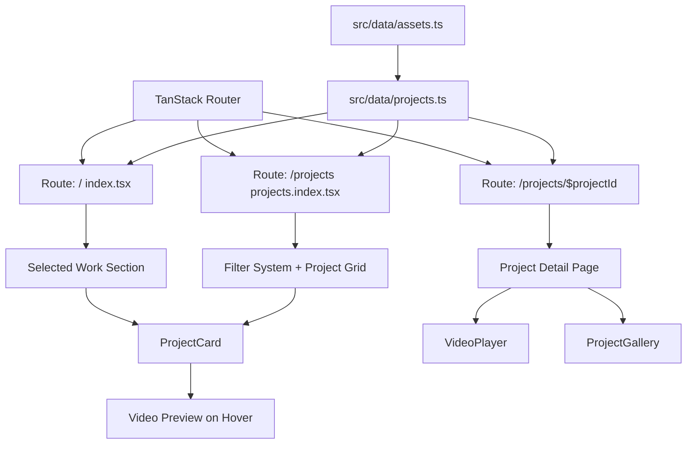

# Design Document: Portfolio Content Improvement

## Overview

This design specifies the technical changes needed to restructure the SitesByKamo portfolio website's project data, introduce video and gallery support, update the homepage selected work section, improve project detail pages, and revise the filtering system. The implementation works within the existing TanStack Router + React + Tailwind CSS + shadcn/ui architecture, modifying data models and components incrementally rather than rebuilding.

The core approach is:
1. Restructure `src/data/projects.ts` to reference real local assets (screenshots + videos) and remove non-existent projects
2. Create an asset manifest module that maps project slugs to imported assets
3. Build reusable `VideoPlayer` and `ProjectGallery` components
4. Update the `ProjectCard` component with hover video preview
5. Revise the homepage editorial grid and project detail page
6. Update the filter system with new categories

## Architecture

The existing architecture remains intact:



**Key architectural decisions:**

1. **Asset manifest pattern**: A new `src/data/assets.ts` file imports all asset files (images and videos) and exports them as a map keyed by project slug. This avoids dynamic imports (which Vite cannot statically analyze) and centralizes all asset references.

2. **Slug-based routing**: The existing `$projectId` param in the route continues to serve as the project identifier. Projects get a new `slug` field that matches the route param, replacing the current `id` field.

3. **Component composition**: Video and gallery are separate reusable components composed into the detail page and card, not baked into those components.

## Components and Interfaces

### New Components

#### `src/components/site/VideoPlayer.tsx`

A reusable video component that handles responsive sizing, poster fallback, lazy loading, and error states.

```typescript
interface VideoPlayerProps {
  src: string;
  poster: string;
  alt: string;
  controls?: boolean;
  muted?: boolean;
  autoPlay?: boolean;
  loop?: boolean;
  className?: string;
  lazy?: boolean;
}
```

Behavior:
- Renders a `<video>` element with `playsInline`, `preload="metadata"`, responsive width
- Shows poster image on error or unsupported format via `onError` handler
- When `lazy` is true, wraps in an intersection observer to defer loading until near-viewport
- Never autoplays unless explicitly set (for hover preview use case)

#### `src/components/site/ProjectGallery.tsx`

Displays a grid of project screenshots with lazy loading.

```typescript
interface ProjectGalleryProps {
  images: Array<{ src: string; alt: string }>;
  projectName: string;
}
```

Behavior:
- Renders images in a responsive grid (1 col mobile, 2 col tablet+)
- All images use `loading="lazy"` and `decoding="async"`
- Consistent aspect ratio via Tailwind's `aspect-video` or `aspect-[4/3]`
- Descriptive alt text per image

#### `src/components/site/VideoPreview.tsx`

A hover-activated muted video preview for project cards.

```typescript
interface VideoPreviewProps {
  videoSrc: string;
  posterSrc: string;
  alt: string;
}
```

Behavior:
- On mouse enter: loads and plays video (muted, loop, no controls)
- On mouse leave: pauses video, resets to poster
- Video element has `preload="none"` until hover to avoid loading all videos on page
- Falls back to poster image if video fails or on touch devices

### Modified Components

#### `ProjectCard` (updated)

- Adds hover video preview when project has a `video` field
- Keeps existing image display as the default state
- On hover: crossfades from poster image to playing video
- On touch devices: no video preview (just static image)

### Data Layer

#### `src/data/assets.ts` (new)

Centralizes all static asset imports. Since filenames contain spaces, Vite handles this fine with standard ES module imports — the import path is a string literal that Vite resolves at build time.

```typescript
// Screenshot imports
import auralink_screenshot from '@/assets/AuraLink_pic&vid/Screenshot 2026-08-11 at 19.29.53.png';
import empty_screenshot from '@/assets/Empty_pic&vid/Screenshot 2026-08-11 at 19.45.17.png';
// ... etc

// Video imports
import auralink_video from '@/assets/AuraLink_pic&vid/Screen Recording 2026-08-11 at 19.33.58.mov';
import empty_video from '@/assets/Empty_pic&vid/Screen Recording 2026-08-11 at 19.44.19.mov';
// ... etc

export interface ProjectAssets {
  screenshot: string;
  video: string;
}

export const projectAssets: Record<string, ProjectAssets> = {
  'auralink': { screenshot: auralink_screenshot, video: auralink_video },
  'empty': { screenshot: empty_screenshot, video: empty_video },
  // ... all 9 projects
};
```

#### `src/data/projects.ts` (restructured)

```typescript
export type ProjectStatus =
  | "LIVE"
  | "CLIENT PROJECT"
  | "CONCEPT"
  | "PROTOTYPE"
  | "REDESIGN"
  | "EXPERIMENTAL";

export type FilterKey =
  | "ALL"
  | "WEBSITES"
  | "ECOMMERCE"
  | "DIGITAL PRODUCTS"
  | "BUSINESS"
  | "FASHION";

export interface Project {
  slug: string;               // URL-safe identifier, used as route param
  name: string;
  category: string;
  filter: Exclude<FilterKey, "ALL">;
  status: ProjectStatus[];
  summary: string;
  description: string;
  challenge: string;
  solution: string;
  result?: string;
  features: string[];
  technologies: string[];
  image: string;              // poster/screenshot — imported asset URL
  video?: string;             // video source — imported asset URL
  gallery: string[];          // array of gallery image URLs (for now: [image])
  imageAlt: string;
  accent?: string;
  liveUrl?: string;
  githubUrl?: string;
  featured?: boolean;
}
```

Changes from current interface:
- `id` → `slug` (URL-safe, matches route param)
- Added `video?: string` for video asset path
- Added `gallery: string[]` for screenshot gallery
- `image` is now required (every project has a screenshot)
- `featured` changed from numeric priority to boolean
- `filter` uses new category set: WEBSITES, ECOMMERCE, DIGITAL PRODUCTS, BUSINESS, FASHION
- Status set updated per requirements (added REDESIGN, removed MVP)
- Removed projects: SLK Electrical, Aura Studio, HairGo, CapitalPilot, JetClean, Instagram Media Extractor, Kiro Development Automation
- Renamed "Vanta Streetwear" → "Venta" (matching the asset folder name `Venta_pic&vid`)

The `projects` array will contain exactly 9 entries with slugs:
`auralink`, `empty`, `extreme-ethics`, `petpal`, `private-location`, `sole-society`, `venta`, `wanpuck-v1`, `wanpuck-v2`

#### Helper functions (updated)

```typescript
export function getProject(slug: string): Project | undefined {
  return projects.find((p) => p.slug === slug);
}

export function getProjectsByFilter(filter: FilterKey): Project[] {
  if (filter === "ALL") return projects;
  return projects.filter((p) => p.filter === filter);
}

export const filters: FilterKey[] = [
  "ALL", "WEBSITES", "ECOMMERCE", "DIGITAL PRODUCTS", "BUSINESS", "FASHION"
];
```

## Data Models

### Project Slug to Asset Folder Mapping

| Slug | Asset Folder | Screenshot | Video |
|------|-------------|-----------|-------|
| auralink | AuraLink_pic&vid | Screenshot 2026-08-11 at 19.29.53.png | Screen Recording 2026-08-11 at 19.33.58.mov |
| empty | Empty_pic&vid | Screenshot 2026-08-11 at 19.45.17.png | Screen Recording 2026-08-11 at 19.44.19.mov |
| extreme-ethics | ExtremeEthics_pic&vid | Screenshot 2026-08-11 at 19.48.24.png | Screen Recording 2026-08-11 at 19.50.12.mov |
| petpal | PetPal_pic&vid | Screenshot 2026-08-11 at 19.57.42.png | Screen Recording 2026-08-11 at 19.57.56.mov |
| private-location | PrivateLocation_pic&vid | Screenshot 2026-08-11 at 19.59.21.png | Screen Recording 2026-08-11 at 19.59.29.mov |
| sole-society | SoleSociety_pic&vid | Screenshot 2026-08-11 at 20.01.22.png | Screen Recording 2026-08-11 at 20.02.12.mov |
| venta | Venta_pic&vid | Screenshot 2026-08-11 at 20.03.42.png | Screen Recording 2026-08-11 at 20.04.12.mov |
| wanpuck-v1 | WanPuckv1_pic&vid | Screenshot 2026-08-11 at 20.16.11.png | Screen Recording 2026-08-11 at 20.16.20.mov |
| wanpuck-v2 | WanPuckv2_pic&vid | Screenshot 2026-08-11 at 20.14.29.png | Screen Recording 2026-08-11 at 20.14.59.mov |

### Filter Category Assignments

| Project | Filter Category |
|---------|----------------|
| AuraLink | DIGITAL PRODUCTS |
| Empty | FASHION |
| Extreme Ethics Clothing | FASHION |
| PetPal | WEBSITES |
| Private Location | BUSINESS |
| Sole Society | ECOMMERCE |
| Venta | ECOMMERCE |
| WanPuck Upholstery V1 | WEBSITES |
| WanPuck Upholstery V2 | WEBSITES |

### SEO Metadata Pattern

- Site title: "SitesByKamo | Web Development & Digital Products"
- Project detail page title: `"[Project Name] — [Category] | SitesByKamo"`
- Project detail page meta description: `project.summary`

## Error Handling

| Scenario | Handling |
|----------|----------|
| Video format unsupported | `<video>` `onError` handler hides video, shows poster image fallback |
| Video fails to load | Same as above — poster image displayed |
| Project slug not found | Existing `notFound()` in route loader (already implemented) |
| Asset import missing | Build-time error from Vite — caught during `bun run dev` |
| Browser doesn't support `.mov` | Poster image fallback via error handler |

Note: `.mov` files (H.264/HEVC in QuickTime container) are supported in Safari and most Chromium browsers. For broader compatibility, a `<source>` element pattern could be used in future, but since these are screen recordings primarily viewed on modern browsers, the poster fallback is sufficient.

## Testing Strategy

### Approach

Since this feature involves UI rendering, data restructuring, and component composition — not pure algorithmic logic — property-based testing is not applicable. The testing strategy uses:

1. **Build verification**: TypeScript compilation + Vite build confirms all imports resolve and types are correct
2. **Manual visual testing**: Dev server inspection of all pages
3. **Lint verification**: ESLint confirms code quality

### Why PBT Does Not Apply

- The feature is primarily UI rendering (React components displaying data)
- Data restructuring is a one-time refactor with fixed inputs (9 projects, specific assets)
- No complex algorithmic transformations, parsers, or serializers
- Component behavior is visual (hover states, video playback) not data-transformative
- Asset imports are static — either they resolve at build time or they don't

### Verification Checklist

1. `bun run dev` starts without TypeScript errors
2. `bun run build` completes successfully
3. All 9 projects render on `/projects` page
4. Filter buttons show correct subsets
5. Each project detail page loads at `/projects/[slug]`
6. Video plays with controls on detail pages
7. Hover video preview works on project cards (desktop)
8. Homepage editorial grid shows all 9 projects
9. No broken image/video references in the console
10. Responsive layout works on mobile viewport

## Implementation Notes

### Handling Filenames with Spaces

Vite handles import paths with spaces natively — the import statement uses a string literal:
```typescript
import screenshot from '@/assets/AuraLink_pic&vid/Screenshot 2026-08-11 at 19.29.53.png';
```
This resolves correctly at build time. No renaming of files is needed.

### Video Lazy Loading Strategy

- Project detail page: `preload="metadata"` on the `<video>` element loads only enough to show duration/dimensions
- Project cards: `preload="none"` — video data only loads on hover
- Intersection observer not strictly needed since `preload="none"` prevents network requests; the browser handles lazy behavior

### Route Parameter Update

The existing route `projects.$projectId.tsx` uses `params.projectId` which maps to the URL segment. The `getProject()` function now looks up by `slug` instead of `id`. The route file name doesn't change — only the lookup logic inside it.

### Homepage Editorial Grid

The selected work section displays all 9 projects in a varied grid layout:
- Row 1: Full-width featured card (1 project)
- Row 2: Two-column split (2 projects)
- Row 3: Two-column split reversed (2 projects)  
- Row 4: Full-width featured card (1 project)
- Row 5: Three-column (3 projects)

This uses the existing 12-column grid system with `lg:col-span-*` classes.

### Contact Config Update

Add `github: "https://github.com/Kamo89"` to `contactConfig` in `src/data/site.ts` (already present — verified).
